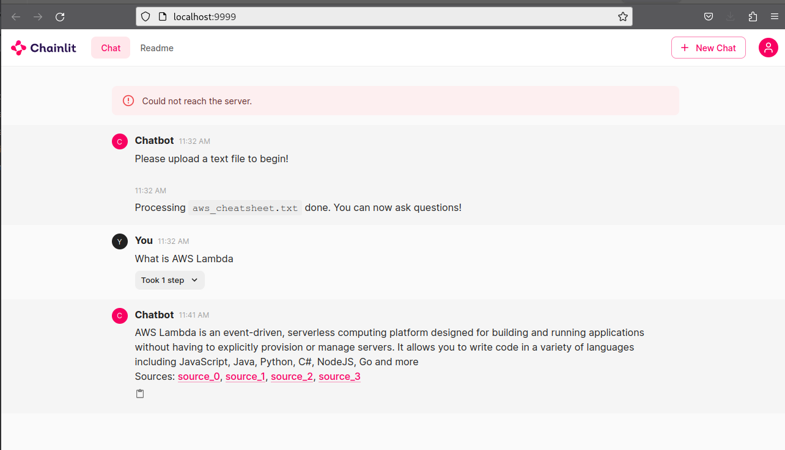

In this tutorial we’re going to build a python chatbot which will interact with document we upload.
As the UI we will use chainlit again.
In this example we will use in memory ChromaDB to store the embeddings. In the later tutorials we will also persist the embeddings to ChromaDB on persistent store.
Based on the n_ctx parameter for llama.cpp and size of your document this might take couple of minutes on your hardware. Be patient :).

# Code process flow

/*
+---------------------+
| init embeddings     |
|                     |
| Use community       |
| provided sentence   |
| embeddings          |
+-----------+---------+
            |
            |
+--------------------+
|Initialize LLM with |
|llama.cpp python    |
| +----------------+ |
| | choose model   | |
| +----------------+ |
| +----------------+ |
| | finetune with  | |
| | temperature    | | 
| | top_p and top_k| |
| +----------------+ |
+-----------+--------+
            |
            |
+--------------------+
| Add LLM provider   |
+-----------+--------+
            |
            |
+---------------------+
| on_chat_start        |
|                      |
| called once on app   |
| start                |
|                      |
| +------------------+ |
| | wait for document| |
| | upload           | |
| +------------------+ |
| +------------------+ |
| | split document   | |
| | to chunks        | |
| +------------------+ |
| +------------------+ |
| | create embeddings| |
| | and store in     | |
| | chromadb         | |
| +------------------+ |
| +------------------+ |
| | create chat      | |
| | session and      | |
| | history          | |
| +------------------+ |
| +------------------+ |
| | update user      | |
| | message          | |
| +------------------+ |
+-----------+----------+
            |
            |
+---------------------+
| on_message          |
|                     |
| called every time   |
| message recieved    |
|                     |
| +-----------------+ |
| | load session    | |
| +-----------------+ |
| +-----------------+ |
| | async process   | |
| | message by llm  | | 
| | against         | |
| | embeddings      | |
| +-----------------+ |
+-----------+---------+
 */
 
# Deployment Steps

Create virtual python environment in current folder (.) or specify directory name instead of .

```
python3 -m venv .
```

Initialize the virtual environment

```
source ./bin/activate
```

Install required python modules

```
python3 -m pip install -r requirements.txt
```

Run the chatbot

```
chainlit run chat.py -w --port 9999