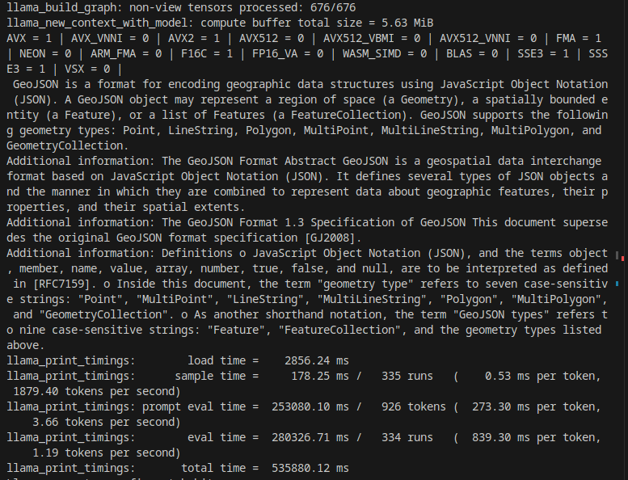

Similar to previous one, we are building application which will chat with document downloaded from web. Here we do not use the chainlit, just pure console app and huggingface python functionality.
We will read the rfc specification of geojson format and then query LLM about particular items in specification.

# Code process flow
```
/*
+---------------------+
| load document       |
| from web and split  |
| into chunks         |
+-----------+---------+
            |
            |
+---------------------+
| Create embeddings   |
| and store them in   |
| chromadb            |
+-----------+---------+
            |
            |
+--------------------+
|Initialize LLM with |
|llama.cpp and       |
| +----------------+ |
| | choose model   | |
| +----------------+ |
| +----------------+ |
| | finetune with  | |
| | temperature    | | 
| | top_p and top_k| |
| +----------------+ |
+-----------+--------+
            |
            |
+--------------------+
| Load predefined    |
| prompt from        |
| huggingface        |
+-----------+--------+
            |
            |
+---------------------+
| invoke prompt via    |
| ragchain             |

+-----------+----------+
 */
 ```
# Deployment Steps

Create virtual python environment in current folder (.) or specify directory name instead of .

```
python3 -m venv .
```

Initialize the virtual environment

```
source ./bin/activate
```

Install required python modules

```
python3 -m pip install -r requirements.txt
```

Run the chatbot

```
python3 ./main.py