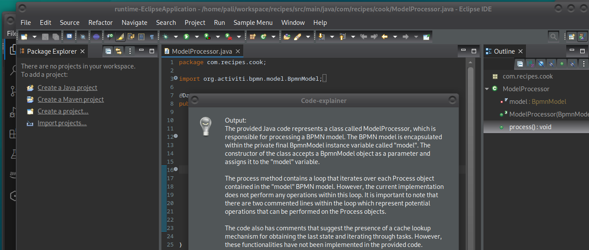

Getting to more complex use cases, we are building custom eclipse plugin which will explain and comment loaded code file.
Based on your HW resources this might take some time to proceed. Be patient :).
We are using eclipse to create eclipse plugin written in java, which calls the shell script run.sh. The shell script wraps up and calls python script, which executes our LLM operation similar to previous tutorials.

# Code process flow
```
/*
+----------------------+
| eclipse plugin       |
| based on hello world |
| example              |
| +------------------+ |
| | button in eclipse| |
| | menu defined in  | |
| | plugin.xml       | |
| +------------------+ |
| +------------------+ |
| | SampleHandler    | |
| | class calls the  | | 
| | run.sh via       | |
| | process builder  | |
| | and shows output | |
| | in dialog        | |
| +------------------+ |
+-----------+----------+
            |
            |
+---------------------+
| run.sh shell script |
| +-----------------+ |
| | activate python | |
| | env             | |
| +-----------------+ |
| +-----------------+ |
| | call main.py    | |
| | with input param| | 
| | java file to    | |
| | analyze         | |
| +-----------------+ |
+-----------+---------+
            |
            |
+--------------------+
|LLM python main.py  |
| +----------------+ |
| | initialize     | |
| | LLAMACpp       | |
| +----------------+ |
| +----------------+ |
| | call prompt    | |
| | with file      | | 
| | content        | |
| +----------------+ |
+-----------+--------+
 */
 ```
# Deployment Steps

Import eclipse plugin to Eclipse and run as Eclipse application. The new button should pop up in eclipse menu. Hitting the button and waiting (maybe minutes) produces the dialog box with LLM results.